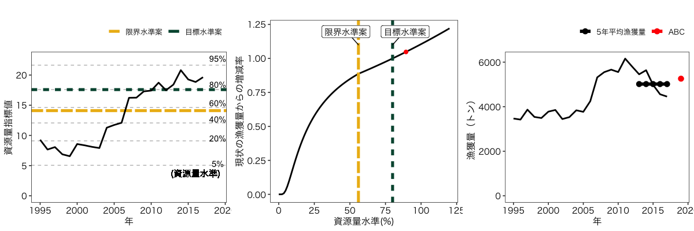
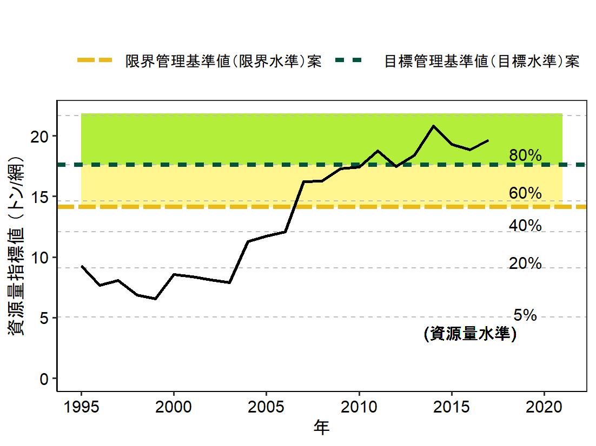
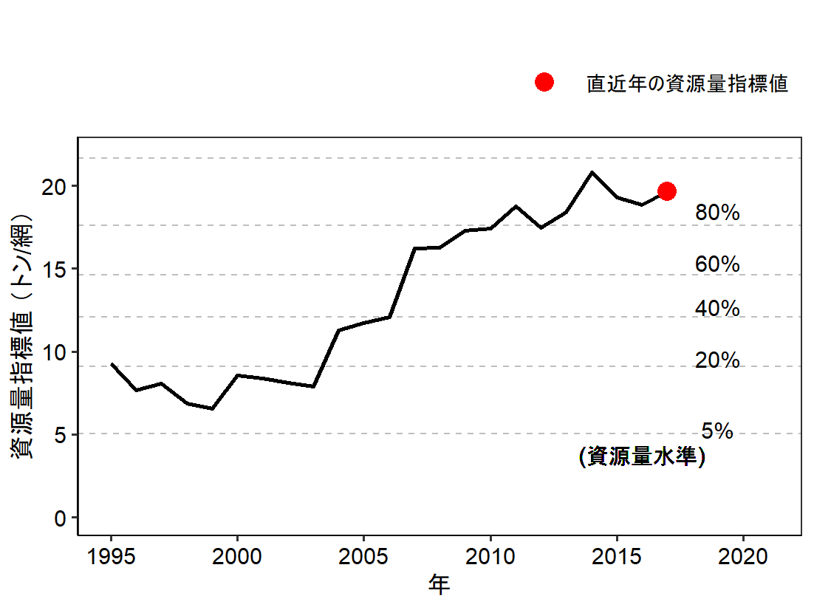
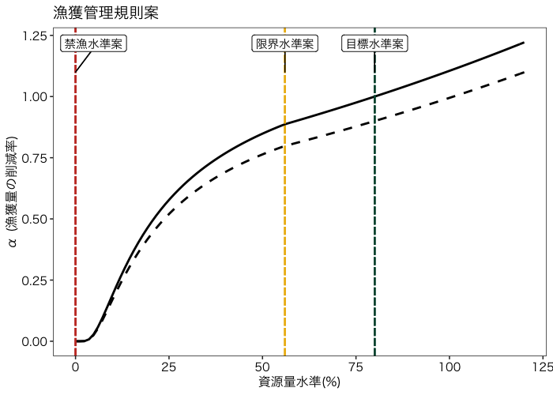

# frasyr23
- Fisheries Research Agency (FRA) provides the method for calculating sustainable yield (SY) with R for data poor fisheries stocks (type 2 and type3)
- ２系(３系)用のABC計算パッケージです

# インストールと呼び出し
```
# install.pakcages("devtools") # <-- devtoolsをインストールしていない人
devtools::install_github("ichimomo/frasyr23") # frasyrのインストール

# 過去の安定版を指定してインストールする場合
# @以下にリリースバージョンを指定します
devtools::install_github("ichimomo/frasyr23@v1.00")

library(frasyr23) # frasyrの呼び出し
library(tidyverse) # こちらのパッケージを使うので呼び出しておく		  
```
- うまくインストールできない場合
- frasyr23と一緒に多くのパッケージが同時にインストールされます．そのパッケージのどれか1つでもうまくインストールできないと，frasry23もインストールできません．対処法としては．．
   - 問題があってインストールできないと言われたパッケージを手動でインストールしてみる（install.packages("パッケージ名")
   - 古いパッケージが残っていてそれを削除できないためにインストールできない場合もあるみたい．以下のサイトを参考に古いパッケージのファイルを消し，それを手動でインストールしてから再トライ http://www.thirtyfive.info/entry/2017/07/28/R%E3%81%AEplyr%E3%83%91%E3%83%83%E3%82%B1%E3%83%BC%E3%82%B8%E3%81%8C%E8%AA%AD%E3%81%BF%E8%BE%BC%E3%82%81%E3%81%AA%E3%81%84%E5%95%8F%E9%A1%8C%E3%81%AE%E5%AF%BE%E5%87%A6

# 主な関数
- 2系の計算
   - calc_abc2 ABCの計算
   - plot_abc2 結果のプロット


# Rコード例
```
help(calc_abc2) # helpを見ると引数の説明などが見れます

# 例データ
catch <- c(15,20,13,14,11,10,5,10,3,2,1,3)
cpue <- c(10,9,8,4,8,11,10,2,3,2,5,2)
data_example <- data.frame(year=2001:2012,cpue=cpue,catch=catch)

# 2系
abc2_ex <- calc_abc2(data_example)
# ある資源量水準Dにおけるαを求めたいとき、関数の引数にD2alpha=xx（0<xx<1）を加える。(デフォルトはNULLで結果は出力されない)
abc2_ex <- calc_abc2(data_example,D2alpha=0.155)
# 保守的なABCを求めたい（βを設定したい）時。（デフォルトはβ=1となっている）
abc2_ex <- calc_abc2(data_example,beta=0.9)

# ABCが決定できる魚種で、かつ漁期が暦の年に一致する場合
graph2_ex <- plot_abc2(abc2_ex,detABC=0)
# ABCが決定できる魚種で、かつ漁期が暦の年に一致しない場合
graph2_ex <- plot_abc2(abc2_ex,fishseason=1,detABC=0)
# ABCが決定できず算定漁獲量を提示する魚種で、かつ漁期が暦の年に一致しない場合
graph2_ex <- plot_abc2(abc2_ex,fishseason=1,detABC=1)
# 提案段階のため「漁獲量の予測値」として示す場合で、かつ漁期が暦の年に一致しない場合
graph2_ex <- plot_abc2(abc2_ex,fishseason=1,detABC=2)
# 目標水準・限界水準・禁漁水準が確定して案を外す場合
graph2_ex <- plot_abc2(abc2_ex,fishseason=1,proposal=FALSE)
# 資源量指標値の時系列グラフの背景に水準を境界とした色を塗りたい場合（かつ資源量指標値に単位を付ける場合）
graph2_ex <- plot_abc2(abc2_ex,fishseason=1,detABC=2,fillarea=TRUE, cpueunit="（トン/網）")
# 資源量指標値の時系列グラフに目標水準・限界水準を重ね描きしない場合（評価報告書作成用）
graph2_ex <- plot_abc2(abc2_ex,fishseason=1,RP=FALSE)

# 2系の水準計算を準用する跨り資源の場合
abc4_ex <- calc_abc2(data_example, BT=0.5)
graph4_ex <- plot_abc2(abc4_ex,fishseason=1,detABC=2, abc4=TRUE)
# calc_abc2関数でBT=0.5とし、plot_abc2関数でabc4=TRUEとすることで資源量指標値の平均水準（50%水準）と過去最低値を参照する図が描画される

# 現在の資源水準が管理基準を決定する分布のどこに位置するか示したい場合
graph2_ex <- plot_abc2(abc2_ex,hcrdist=T)

# AAVのちがいを見る	   
abc2_ex_AAV1 <- calc_abc2(data_example,AAV=1)	     

```

# 実データの解析例とグラフ

```
# アカガレイデータの呼び出し
data(data_aka)
# 2系
abc2_aka <- calc_abc2(data_aka,beta=1)
graph2_aka <- plot_abc2(abc2_aka, detABC=2, fillarea=FALSE)
# グラフをセーブする場合
# ggsave(width=420,height=150,dpi=200,units="mm", graph2_aka[[2]], file="aka2.png")
```



```
# 資源量指標値の図だけ抜き出し、かつ色を塗ってみる（かつ資源量指標値に単位を付けてみる）
graph2_aka <- plot_abc2(abc2_aka, detABC=2, fillarea=TRUE, cpueunit="（トン/網）")
# グラフをセーブする場合
# ggsave(width=140,height=105,dpi=200,units="mm", graph2_aka$graph.component[[1]], file="aka2cpue_fill.png")
```
		


```
# 資源量指標値の図だけ抜き出すが、目標水準・限界水準は描画しない
graph2_aka <- plot_abc2(abc2_aka, detABC=2, fillarea=FALSE, RP=FALSE, cpueunit="（トン/網）")
# グラフをセーブする場合
# ggsave(width=140,height=105,dpi=200,units="mm", graph2_aka$graph.component[[1]], file="aka2cpue_woRP.png")
```
		


# HCRのみ描画し、比較する
```
# 2系
## デフォルトのパラメータ
abc2_aka <- calc_abc2(data_aka,beta=1)
## 保守的なABC
abc2_aka_conservABC <- calc_abc2(data_aka,beta=0.9)
## 比較
plot_hcr2(list(abc2_aka,abc2_aka_conservABC))
# グラフをセーブする場合
# ggsave(file="hcr2_compare.png",width=5,height=5)

```



# 計算オプション

```
# 資源量指標値をCPUEデータそのものを利用するのではなく平滑化したり、
# 水準計算に正規分布ではなく経験分布を使ったり、さらには水準を計算する年を固定するオプションがあります

# 例データ
catch <- c(15,20,13,14,11,10,5,10,3,2,1,3)
cpue <- c(10,9,8,4,8,11,10,2,3,2,5,2)
data_example <- data.frame(year=2001:2012,cpue=cpue,catch=catch)

# ABC計算の際、現時点(CPUE時系列最終年)での資源量指標値に最近年移動平均CPUE(n.cpue年)を使う
abc2_ex_smD <- calc_abc2(data_example, smooth.cpue=T, n.cpue=3)

# 資源量指標値を求める際、CPUE時系列データを一度平滑化(n.cpue年)してから正規分布に当てる
abc2_ex_smooth_dist <- calc_abc2(data_example, smooth.dist=T, n.cpue=3)

# 資源量指標値を求める際、CPUE時系列データを標準正規分布ではなく経験分布(累積経験分布関数ecdfを使う)に当てる
abc2_ex_empir_dist <- calc_abc2(data_example, empir.dist=T)

# 資源量指標値を求める際、CPUE時系列データを経験分布に当てるが、過去最大・最小をそれぞれ1,0として相対値を求める簡素なものを使う
abc2_ex_simple_em_dist <- calc_abc2(data_example, empir.dist=T,simple.empir=T)

# 管理水準を求める際、CPUE時系列の最終年ではなく、CPUEデータの初出年から特定の年(BTyear)までの時系列を使う
abc2_ex_bt2010 <- calc_abc2(data_example, BTyear=2010)

```

