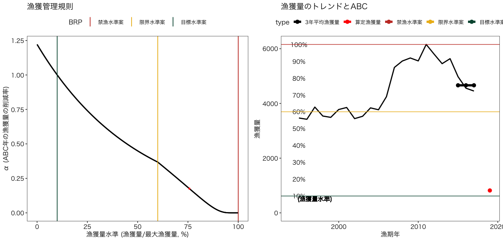

# frasyr23
- Fisheries Research Agency (FRA) provides the method for calculating sustainable yield (SY) with R for data poor fisheries stocks (type 2 and type3)
- ２系・３系用のABC計算パッケージ（試験運用中）です

# インストールと呼び出し
```
# install.pakcages("devtools") # <-- devtoolsをインストールしていない人
devtools::install_github("ichimomo/frasyr23") # frasyrのインストール
library(frasyr23) # frasyrの呼び出し
library(tidyverse) # こちらのパッケージを使うので呼び出しておく		  
```
- うまくインストールできない場合
- frasyr23と一緒に多くのパッケージが同時にインストールされます．そのパッケージのどれか1つでもうまくインストールできないと，frasry23もインストールできません．対処法としては．．
   - 問題があってインストールできないと言われたパッケージを手動でインストールしてみる（install.packages("パッケージ名")
   - 古いパッケージが残っていてそれを削除できないためにインストールできない場合もあるみたい．以下のサイトを参考に古いパッケージのファイルを消し，それを手動でインストールしてから再トライ http://www.thirtyfive.info/entry/2017/07/28/R%E3%81%AEplyr%E3%83%91%E3%83%83%E3%82%B1%E3%83%BC%E3%82%B8%E3%81%8C%E8%AA%AD%E3%81%BF%E8%BE%BC%E3%82%81%E3%81%AA%E3%81%84%E5%95%8F%E9%A1%8C%E3%81%AE%E5%AF%BE%E5%87%A6

# 主な関数
- 2系の計算
   - calc_abc2 ABCの計算
   - plot_abc2 結果のプロット

- 3系の計算
   - calc_abc3 ABCの計算
   - plot_abc3 結果のプロット

# Rコード例
```
help(calc_abc2) # helpを見ると引数の説明などが見れます

# 例データ
catch <- c(15,20,13,14,11,10,5,10,3,2,1,3)
cpue <- c(10,9,8,4,8,11,10,2,3,2,5,2)
data_example <- data.frame(year=2001:2012,cpue=cpue,catch=catch,D2alpha=0.1)

# 2系
abc2_ex <- calc_abc2(data_example)
# ある資源量水準Dにおけるαを求めたいとき、関数の引数にD2alpha=xx（0<xx<1）を加える。(デフォルトはNULLで結果は出力されない)
abc2_ex <- calc_abc2(data_example,D2alpha=0.155)

# ABCが決定できる魚種で、かつ漁期が暦の年に一致する場合
graph2_ex <- plot_abc2(abc2_ex)
# ABCが決定できる魚種で、かつ漁期が暦の年に一致しない場合
graph2_ex <- plot_abc2(abc2_ex,fishseason=1)
# ABCが決定できない魚種で、かつ漁期が暦の年に一致しない場合
graph2_ex <- plot_abc2(abc2_ex,fishseason=1,detABC=1)


# AAVのちがいを見る	   
abc2_ex_AAV1 <- calc_abc2(data_example,AAV=1)	     

# 3系
## dataにCPUEが入っていても無視します
abc3_ex <- calc_abc3(data_example)
# ABCが決定できる魚種で、かつ漁期が暦の年に一致する場合
graph3_ex <- plot_abc3(abc3_ex)
# ABCが決定できる魚種で、かつ漁期が暦の年に一致しない場合
graph3_ex <- plot_abc3(abc3_ex,fishseason=1)
# ABCが決定できない魚種で、かつ漁期が暦の年に一致しない場合
graph3_ex <- plot_abc3(abc3_ex,fishseason=1,detABC=1)
```

# 実データの解析例とグラフ

```
# アカガレイデータの呼び出し
data(data_aka)
# 2系
abc2_aka <- calc_abc2(data_aka,beta=1)
graph2_aka <- plot_abc2(abc2_aka)
# グラフをセーブする場合
# ggsave(graph2_aka[[2]],file="aka2.png")
```


```	  	   	
abc3_aka <- calc_abc3(data_aka)
graph3_aka <- plot_abc3(abc3_aka)
# グラフをセーブする場合
# ggsave(graph3_aka[[2]],file="aka3.png")


```



# HCRのみ描画し、比較する
```
# 2系
## デフォルトのパラメータ
abc2_aka <- calc_abc2(data_aka,beta=1)
## 保守的なABC
abc2_aka_conservABC <- calc_abc2(data_aka,beta=0.9)
## 比較　ABCが決定できる魚種
plot_hcr2(list(abc2_aka,abc2_aka_conservABC))
## 比較　ABCが決定できない魚種
plot_hcr2(list(abc2_aka,abc2_aka_conservABC),detABC=1)
```
<!--
ggsave(file="hcr2_compare.png",width=5,height=3)
-->
	
