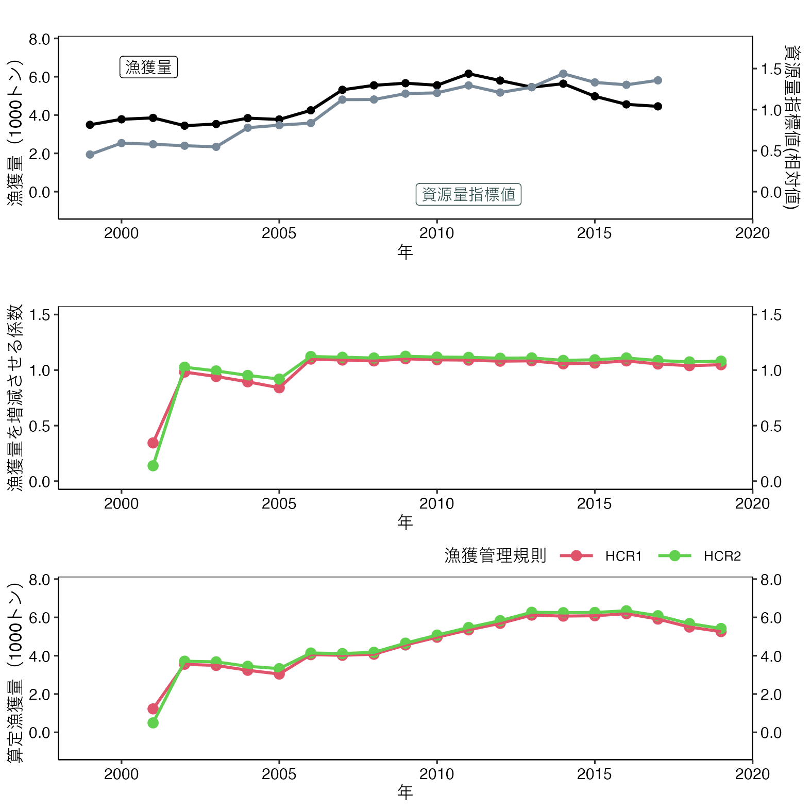

# frasyr23
- Fisheries Research Agency (FRA) provides the method for calculating sustainable yield (SY) with R for data poor fisheries stocks (type 2 and type3)
- ２系(３系)用のABC計算パッケージです

# インストールと呼び出し
```
# install.pakcages("devtools") # <-- devtoolsをインストールしていない人
devtools::install_github("ichimomo/frasyr23") # frasyrのインストール

# 過去の安定版を指定してインストールする場合
# @以下にリリースバージョンを指定します
devtools::install_github("ichimomo/frasyr23@v1.00")

library(frasyr23) # frasyrの呼び出し
library(tidyverse) # こちらのパッケージを使うので呼び出しておく		  
```
- うまくインストールできない場合
- frasyr23と一緒に多くのパッケージが同時にインストールされます．そのパッケージのどれか1つでもうまくインストールできないと，frasry23もインストールできません．対処法としては．．
   - 問題があってインストールできないと言われたパッケージを手動でインストールしてみる（install.packages("パッケージ名")
   - 古いパッケージが残っていてそれを削除できないためにインストールできない場合もあるみたい．以下のサイトを参考に古いパッケージのファイルを消し，それを手動でインストールしてから再トライ http://www.thirtyfive.info/entry/2017/07/28/R%E3%81%AEplyr%E3%83%91%E3%83%83%E3%82%B1%E3%83%BC%E3%82%B8%E3%81%8C%E8%AA%AD%E3%81%BF%E8%BE%BC%E3%82%81%E3%81%AA%E3%81%84%E5%95%8F%E9%A1%8C%E3%81%AE%E5%AF%BE%E5%87%A6

# 主な関数
- 2系の計算
   - calc_abc2 ABCの計算　
      - オプションは[計算オプション](https://github.com/ichimomo/frasyr23#%E8%A8%88%E7%AE%97%E3%82%AA%E3%83%97%E3%82%B7%E3%83%A7%E3%83%B3)を参照
   - plot_abc2 結果のプロット
      - オプションは[プロットオプション](https://github.com/ichimomo/frasyr23#%E3%83%97%E3%83%AD%E3%83%83%E3%83%88%E3%82%AA%E3%83%97%E3%82%B7%E3%83%A7%E3%83%B3)を参照
   - plot_hcr2 HCRの図のみプロット、複数の結果の比較も可能
      - 詳細は[HCRのみ描画し、比較する](https://github.com/ichimomo/frasyr23#hcr%E3%81%AE%E3%81%BF%E6%8F%8F%E7%94%BB%E3%81%97%E6%AF%94%E8%BC%83%E3%81%99%E3%82%8B)を参照 
   - plot_retro2 過去に遡ってABC算定した結果をプロット
      - 詳細は[過去の算定漁獲量を時系列プロットする](https://github.com/ichimomo/frasyr23#hcr%E3%81%AE%E3%81%BF%E6%8F%8F%E7%94%BB%E3%81%97%E6%AF%94%E8%BC%83%E3%81%99%E3%82%8B)を参照 
# Rコード例
```
help(calc_abc2) # helpを見ると引数の説明などが見れます

# 例データ
catch <- c(15,20,13,14,11,10,5,10,3,2,1,3)
cpue <- c(10,9,8,4,8,11,10,2,3,2,5,2)
data_example <- data.frame(year=2001:2012,cpue=cpue,catch=catch)

# 2系としてABC算出(デフォルトのパラメータは目標水準BT=0.8、限界水準BL=BT*PL=0.8*0.7=0.56、禁漁水準=0、調整パラメータδは(0.5,0.4,0.4))
abc2_ex <- calc_abc2(data_example)
# 保守的なABCを求めたい（βを設定したい）時。（デフォルトはβ=1となっている）
abc2_ex_09beta <- calc_abc2(data_example,beta=0.9)
# 目標水準BTを0.7、調整パラメータδを(0.4,0.7,1.0)にした場合
abc2_ex_BT07 <- calc_abc2(data_example,BT=0.7,tune.par=c(0.4,0.7,1.0))

# 結果のプロット（ABCが決定できる魚種で、かつ漁期が暦の年に一致する場合）　表示文言などプロットのオプションは後述の[プロットオプション]を参照
graph2_ex <- plot_abc2(abc2_ex,detABC=0)
# ABCが決定できる魚種で、かつ漁期が暦の年に一致しない場合
graph2_ex <- plot_abc2(abc2_ex,fishseason=1,detABC=0)

# 2系の水準計算を準用する跨り資源の場合
abc4_ex <- calc_abc2(data_example, BT=0.5)
graph4_ex <- plot_abc2(abc4_ex,fishseason=1,detABC=2, abc4=TRUE)
# calc_abc2関数でBT=0.5とし、plot_abc2関数でabc4=TRUEとすることで資源量指標値の平均水準（50%水準）と過去最低値を参照する図が描画される

# AAVのちがいを見る	   
abc2_ex_AAV1 <- calc_abc2(data_example,AAV=1)

# 漁獲量・CPUE時系列データの最終年の1年後のABCを表示する場合
abc2_ex_nexty <- calc_abc2(data_example,timelag0=T)
graph2_ex_nexty <- plot_abc2(abc2_ex_nexty)

# 漁獲量・CPUE時系列データの最終年の1年後のABCを表示するが、漁獲量は最終年データがない場合
catch2 <- c(15,20,13,14,11,10,5,10,3,2,1,NA)
data_example2 <- data.frame(year=2001:2012,cpue=cpue,catch=catch2)
# この場合は、ABC算出に使う最近年漁獲量は6年を指定（ただし、最終年データはna.rm=Tにより実質最近年5年平均漁獲量になる）
# plot_abc2では6年の漁獲量がプロットされてしまうのでlatest_Catch_naオプション（またはignore_naCatch_point）を使用
abc2_ex_nexty2 <- calc_abc2(data_example2,n.catch=6,timelag0=T)
graph2_ex_nexty2 <- plot_abc2(abc2_ex_nexty2,latest_Catch_na=T)
# ignore_naCatch_pointはNAとなる点を除いてn.catch年平均の横棒が表示される(latest_Catch_naオプションと併用は不可)
graph2_ex_nexty2 <- plot_abc2(abc2_ex_nexty2,ignore_naCatch_point=T)
```

# 実データの解析例とグラフ

```
# アカガレイデータの呼び出し
data(data_aka)
# 2系
abc2_aka <- calc_abc2(data_aka,beta=1)
graph2_aka <- plot_abc2(abc2_aka, detABC=2, fillarea=FALSE)
# グラフをセーブする場合
# ggsave(width=420,height=150,dpi=200,units="mm", graph2_aka[[2]], file="aka2.png")
```


```
# 資源量指標値の図だけ抜き出し、かつ色を塗ってみる（かつ資源量指標値に単位を付けてみる）
graph2_aka <- plot_abc2(abc2_aka, detABC=2, fillarea=TRUE, cpueunit="（トン/網）")
# グラフをセーブする場合
# ggsave(width=140,height=105,dpi=200,units="mm", graph2_aka$graph.component[[1]], file="aka2cpue_fill.png")
```
		


```
# 資源量指標値の図だけ抜き出すが、目標水準・限界水準は描画しない
graph2_aka <- plot_abc2(abc2_aka, detABC=2, fillarea=FALSE, RP=FALSE, cpueunit="（トン/網）")
# グラフをセーブする場合
# ggsave(width=140,height=105,dpi=200,units="mm", graph2_aka$graph.component[[1]], file="aka2cpue_woRP.png")
```
		


# HCRのみ描画し、比較する
```
# 2系のデフォルトのパラメータ
abc2_aka <- calc_abc2(data_aka,beta=1)
# 保守的なABC
abc2_aka_conservABC <- calc_abc2(data_aka,beta=0.9)
# 上記２つの比較（管理水準の線はデフォルトでlistの1番目）
plot_hcr2(list(abc2_aka,abc2_aka_conservABC),hscale="dense")
# グラフをセーブする場合
# ggsave(file="hcr2_compare.png",width=5,height=5)
# 2つ以上のHCRを表示する時に、intersection＝Tで交点を表示する
# デフォルト設定とBT=0.7,δ=(0.4,0.7,1.0)の場合との交点
abc2_aka_BT07 <- calc_abc2(data_aka,BT=0.7,tune.par=c(0.4,0.7,1.0))
plot_hcr2(list(abc2_aka,abc2_aka_BT07),intersection=T)
```


# 過去の算定漁獲量を時系列プロットする
```
# 2系のデフォルトのパラメータ
abc2_aka <- calc_abc2(data_aka)
# 過去の算定漁獲量をプットする
graph_retro2 <- plot_retro2(abc2_aka)
# 目標水準BTを0.7に引き下げる場合と過去の算定漁獲量を比較
abc2_aka_BT07 <- calc_abc2(data_aka,BT = 0.7,tune.par = c(0.4,0.7,1.0))
graph_retro2_compare <- plot_retro2(list(abc2_aka,abc2_aka_BT07))
# グラフをセーブする場合
# ggsave(file="retro2_compare.png",width=5,height=5)
# 2つ以上の算定漁獲量と漁獲を増減させる係数のほか、漁獲量と資源量指標値も同じ期間表示する
graph_retro2_cc <- plot_retro2(list(abc2_aka,abc2_aka_BT07),cc_plot=T)
```


# 計算オプション

```
# ABC算定の際、漁獲量を増減させる係数と最近年の漁獲量をかけるが、デフォルトでは5年平均漁獲量としているが、これを変更する場合、n.catchオプションで指定する
## アカガレイデータ
data(data_aka)
abc2_aka_catch6 <- calc_abc2(data_aka,n.catch=6)

# ある資源量水準Dにおけるαを求めたいとき、関数の引数にD2alpha=xx（0<xx<1）を加える。(デフォルトはNULLで特定のDについての結果は出力されない)
abc2_aka_D0155 <- calc_abc2(data_aka,D2alpha=0.155)

# 管理水準を求める際、CPUE時系列の最終年ではなく、CPUEデータの初出年から特定の年(BTyear)までの時系列を使う
abc2_aka_bt2010 <- calc_abc2(data_aka, BTyear=2010)

# 変動緩和措置として、2系ルールで算出されるABCが前年漁獲量の1±respを超える（下回る）ときに、ABCを前年漁獲量×(1±resp)に置き換える場合（前年漁獲量=NAの場合、さらに1年前の漁獲量を参照）
# ABCが置き換えられたときに、出力結果表示でも置き換えられた結果だと示される
abc2_aka_resp <- calc_abc2(data_aka,tune.par=c(0.3,0.6,0.3),resp=0.4)


# 資源量指標値をCPUEデータそのものを利用するのではなく平滑化したり、
# 水準計算に正規分布ではなく経験分布を使ったり、さらには水準を計算する年を固定するオプションがあります(MSEでのパフォーマンスは公式に評価していません)
## 例データ
catch <- c(15,20,13,14,11,10,5,10,3,2,1,3)
cpue <- c(10,9,8,4,8,11,10,2,3,2,5,2)
data_example <- data.frame(year=2001:2012,cpue=cpue,catch=catch)

# ABC計算の際、現時点(CPUE時系列最終年)での資源量指標値に最近年移動平均CPUE(n.cpue年)を使う
abc2_ex_smD <- calc_abc2(data_example, smooth.cpue=T, n.cpue=3)
# 資源量指標値を求める際、CPUE時系列データを一度平滑化(n.cpue年)してから正規分布に当てる
abc2_ex_smooth_dist <- calc_abc2(data_example, smooth.dist=T, n.cpue=3)
# 資源量指標値を求める際、CPUE時系列データを標準正規分布ではなく経験分布(累積経験分布関数ecdfを使う)に当てる
abc2_ex_empir_dist <- calc_abc2(data_example, empir.dist=T)
# 資源量指標値を求める際、CPUE時系列データを経験分布に当てるが、過去最大・最小をそれぞれ1,0として相対値を求める簡素なものを使う
abc2_ex_simple_em_dist <- calc_abc2(data_example, empir.dist=T,simple.empir=T)

```

# プロットオプション
```
# ABC決定しているor試算提示か、漁期は暦かどうかなどで表示文言を変えられます
# 例データの解析結果をつかった表示例

# ABCが決定できる魚種で、かつ漁期が暦の年に一致する場合
graph2_ex <- plot_abc2(abc2_ex,detABC=0)
# ABCが決定できる魚種で、かつ漁期が暦の年に一致しない場合
graph2_ex <- plot_abc2(abc2_ex,fishseason=1,detABC=0)
# ABCが決定できず算定漁獲量を提示する魚種で、かつ漁期が暦の年に一致しない場合
graph2_ex <- plot_abc2(abc2_ex,fishseason=1,detABC=1)
# 提案段階のため「漁獲量の予測値」として示す場合で、かつ漁期が暦の年に一致しない場合
graph2_ex <- plot_abc2(abc2_ex,fishseason=1,detABC=2)
# 目標水準・限界水準・禁漁水準が確定して案を外す場合
graph2_ex <- plot_abc2(abc2_ex,fishseason=1,proposal=FALSE)
# 資源量指標値の時系列グラフの背景に水準を境界とした色を塗りたい場合（かつ資源量指標値に単位を付ける場合）
graph2_ex <- plot_abc2(abc2_ex,fishseason=1,detABC=2,fillarea=TRUE, cpueunit="（トン/網）")
# 資源量指標値の時系列グラフに目標水準・限界水準を重ね描きしない場合（評価報告書作成用）
graph2_ex <- plot_abc2(abc2_ex,fishseason=1,RP=FALSE)

# 現在の資源水準が管理基準を決定する分布のどこに位置するか示したい場合
graph2_ex <- plot_abc2(abc2_ex,hcrdist=T)


# plot_abc2のHCRについてメモリや補助線の表示オプションを選べます
# アカガレイデータの解析結果をつかった表示例

# 縦軸の目盛はhcrhscaleオプションで0.2,0.25,0.5刻みがそれぞれhcrhscale="dense","middle","sparse"で選べる
graph_aka <- plot_abc2(abc2_aka, hcrhscale="sparse")
# 縦軸の補助線をhcrhlineオプション("none","one","hscale")で選べる
graph_aka <- plot_abc2(abc2_aka, hcrhscale="dense", hcrhline="one")
# 縦軸横軸の0をプロット枠ぴったりにする
graph_aka <- plot_abc2(abc2_aka, hcrhscale="sparse", hcrhline="hscale", plotexactframe=T)


# plot_hcr2のHCRについて表示オプションを選べます
# vlineオプションで横軸の管理基準値補助線をつけるか否か選べる
plot_hcr2(list(abc2_aka,abc2_aka_conservABC),vline=F)
# 現在の資源量水準に興味がなく、HCRの曲線のみ表示したい場合、is_pointオプションをFにする
plot_hcr2(list(abc2_aka,abc2_aka_conservABC),is_point=F)
# 禁漁水準を非表示とするために、vlineBanオプションをFにする
plot_hcr2(list(abc2_aka,abc2_aka_conservABC),vlineBan=F)
# 現在の資源量水準のポイントが重なるなど、表示に難がある場合、change_psオプションで縮小倍率x(0<x<1)を選ぶ
plot_hcr2(list(abc2_aka,abc2_aka_conservABC),change_ps=0.8)
# 現在の資源量水準のポイントについては結果オブジェクトリストの一つ目だけ表示したい場合、one_pointオプションをTにする
plot_hcr2(list(abc2_aka,abc2_aka_conservABC),one_point=T)

# 比較するHCRのうち、listの何番目の管理水準を表示させるかをオプションvline.listnumに入れて選ぶ（デフォルトは1番目）
abc2_aka_BT07<-calc_abc2(data_aka,BT=0.7,tune.par=c(0.4,0.7,1.0))
plot_hcr2(list(abc2_aka,abc2_aka_BT07),vline.listnum=2)
# 管理水準のラベルにリストごとの名前を頭につける場合、label.listにベクトルで指定する (デフォルトはNULLで名前の区別なし)
plot_hcr2(list(abc2_aka,abc2_aka_BT07),vline.listnum=2,label.list=c("Default","BT07"))
# 比較するHCRのすべての管理水準を表示させる場合、vline.listnumを0とする
# ラベルに名前をつける場合、label.listオプションにベクトルで入れる(デフォルトではリストの番号)
abc2_aka_BT06<-calc_abc2(data_aka,BT=0.6,tune.par=c(0.3,0.7,1.0))
plot_hcr2(list(abc2_aka,abc2_aka_BT07,abc2_aka_BT06),vline.listnum=0,label.list=c("Default","BT07","BT06"),vlineBan=F)


# 複数のABC算出結果オブジェクトをHCR,ABCのプロットで同時に出力し比較する（ただし、最大５つまで）
## デフォルトのパラメータ
abc2_aka <- calc_abc2(data_aka,beta=1)
## 保守的なABC
abc2_aka_conservABC <- calc_abc2(data_aka,beta=0.9)
## BTを0.7、チューニングパラメータδを(0.4,0.7,1.0)にした場合のABC
abc2_aka_BT07 <- calc_abc2(data_aka,BT=0.7,tune.par=c(0.4,0.7,1.0))

graph_abc2_multires <- plot_abc2_multires(list(abc2_aka,abc2_aka_conservABC,abc2_aka_BT07))

```
